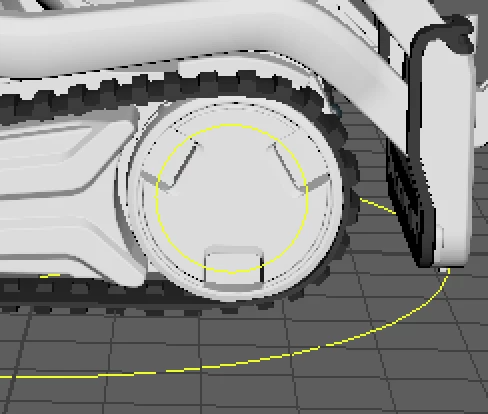

# Animate Movement using separate wheel controls
Created by Daria Jerjomina Oct 02, 2017

Cozmo’s rig has two wheel controls positioned at his front wheels named *x:wheel_R_ctrl* and *x:wheel_L_ctrl* for the right and left wheels accordingly.

Both wheel Ctrs have only rotation attribute available. Changing rotation will change the movement of the 3d wheel.

Based on robot’s single axle structure when two wheels move with the same speed, robot moves forward, when one wheel moves slower than the other, robot moves in the arc, and when one wheel moves opposite to the other it makes a point turn.

*Example:* We want Cozmo to move forward by a full rotation in two seconds

1. Key both wheels to be 0 at 0
2. Key both wheels to be 360 deg at 60 fr
3. Export

Graph editor is a good indicator of how Cozmo is moving, if dealing with values gets too cumbersome.

If in linear mode the two wheel splines are in parallel, Cozmo will move straight

If by continuing the two splines between the two current and two previous keys until their intersection the four keys make a isosceles triangle, Cozmo will make a turn in place

 or 

Any other spline look will result in an *arc turn.*

By default rotation of the wheels is being set in degrees. You might want to use it in radians in order to avoid dealing with large numbers. In order to do that change your preferences to use radians instead of the degrees. Exporter will use then read your preferences and use the specified values.

[This video demonstrates how to do that:](deg_rad_wheels.mov)

