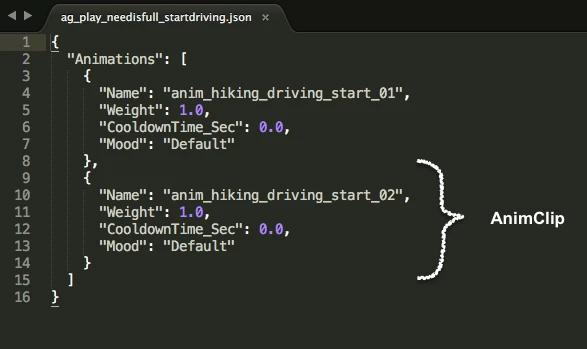

# Animation Pipeline Wiki

Created by Shmuel Segal Jun 14, 2017

## OVERVIEW
This is a live wiki page with information about Cozmo's animation pipeline. 

## UNITS STANDARDS
### Time Units
*Frames per second* (fps) and *milliseconds* (ms) are the 2 main time units used in the animation pipeline. In Autodesk Maya, the animators use a 30 fps standard. On export, the time units convert to milliseconds, the standard time unit in engine.

On export the animations are converted to play at 33 fps – the frame rate the animation stream is operating at. Using a different frame rate will most likely make the animation streamer drop frames.

### Geometric Units
* *Centimeters* (cm), *Millimeters* (mm) and *degrees* (°) are the main geometric units used in the animation pipeline. In Autodesk Maya, the standard distance unit is a centimeter. On export the animation keyframes are converted to use Millimeters.
* Lift keyframes use rotation X (°) values in Maya. On export the lift rotation keyframes are converted to lift height (mm).
* *Millimeter/Second* (m/s) is the standard speed unit.

## OPTIMAL STANDARDS
### Head Angles
#### Detecting Cubes
The generally accepted optimal head angle for detecting cubes on the 0 ground plane is -17°. This value is currently based on observation and subject to change.

### Lift Height
It is generally advisable not to move the lift to it's max height, in animation and in general. At max height the gears get sticky many time and the lift may have an undesired "pop" on the way down.

## ANIMATION PRODUCTION PROCESS

*For the sake of simplicity this flowchart only includes processes relevant specifically to the animation pipeline. Processes that don't touch on animation are left out.

## ANIMATION ASSETS
### Stubs
#### What are they for?
Stubs are placeholder AnimClips. They have just enough keyframes to support the functionality of the AnimClip, but that's it, no polish, acting, or personality is expected. (example: if the animation is meant to tap a cube, the stub will have the lift going up and down, but no animation work will be done on the eyes or the head). The purpose of stubs is to provide the engineering team all the animation assets required to hook up a behavior quickly, and not have them wait for the animator until he is done polishing.

#### How do I know whether an animation clip is a stub or a final?

Animation stubs have a designated backpack light pattern:

Rainbow backpack light pattern signals that this animation is a stub and going to be revisited and polished by an animator

Any time the rainbow light pattern is on, it means the AnimClip is currently a stub and going to be replace with a final AnimClip once it is done and approved. Animations with any other backpack light pattern or no backpack light pattern at all are either finaled or being polished, which means there shouldn't be any dramatic changes to the animation moving forward.

### AnimClips
AnimClips are the main assets that drive the animated performance on the robot. They are generated by an animator in the Game Exporter in Autodesk Maya. The general workflow is the animator creates an animation in a Maya scene, splits the animation into multiple AnimClips and exports the AnimClips in a JSON format. The JSON files are then bundled and compressed into a TAR file and get uploaded on to a SVN repository (cozmo-assets).

### AnimGroups
AnimGroups are containers for one or more AnimClips that meant to play at in a single state. They allow to randomize AnimClips, loop them, define head angle parameters and other functions required to allow the engine to "choose" what animation to play at a specific state out of a variety of AnimClips.

*Example of an AnimGroup JSON file.

#### AnimGroup Parameters

Weight
: Float. This value defines the play probability ratio for each AnimClip. If each AnimClip within an AnimGroup has the same value of 1.0, there's an equal probability that any of the AnimClips may play when the AnimGroup is called.

CooldownTIme_Sec
: Float. Defines the period of time to wait before playing the specified AnimClip after it was playing once. This parameter is meant to avoid a situation where the same AnimClip plays twice in a row an look repetitive or robotic.

Mood
: String. This parameter is tied to the mood manager which we're rarely using at the moment. It suppose to define which AnimClip should play in a specific state based on the mood state of the robot. If the robot is in a "Happy" state, the engine would only play AnimClips with a "Mood" parameter set to "Happy", and avoid playing AnimClips with a "Mood" parameter set to "Sad".

UseHeadAngle
: Boolean. Defines whether to use the head angle functionality or not. See Head Angles for more details.

HeadAngleMin_Deg
: Float. Defines the minimum head angle the AnimClip should be playing at.

HeadAngleMax_Deg
: Float. Defines the maximum head angle the AnimClips should be playing at.

### Head Angles

#### What are head angles?

The Head Angles system is basically an AnimClip chooser. It chooses what AnimClip to play based on a certain angle range the robot's head has to be in in order for the animation to play correctly. For example, if the robot has to look at the user's face, the engine calculates at what angle the robot has to raise or lower his head to, to covey that he is looking at the user. Based on that value and the HeadAngle min/max values on each AnimClip, the engine will choose the AnimClip designed to play at the correct angle.

#### How do head angles work?

Any time an AnimGroup is played and the "UseHeadAngle" parameter is set to TRUE, the engine will look at the current head angle value of the robot. Based on the returned value, the engine will play the AnimClip with the corresponding min/max HeadAngle values.

For example, the AnimGroup `ag_lookInPlaceForFaces_bodyMovePause.json` has the "UseHeadAngle" parameter set to TRUE. If `ag_lookInPlaceForFaces_bodyMovePause.json` is called and the head angle on the robot is set to be -15.0, that means that the AnimClip "anim_lookinplaceforfaces_keepalive_long_head_angle_-20" will be played since -15.0 falls between -25.0 and -10.0.

_Pros and Cons of head angles_
 

## ANIMATION ASSETS

### AnimationGroups
Details on AnimGroups and the JSON files.

### Animations
Details on TAR files and the JSON files, including the different tracks:

* BodyMotionKeyFrame
* LiftHeightKeyFrame
* HeadAngleKeyFrame
* ProceduralFaceKeyFrame
* FaceAnimationKeyFrame
* RobotAudioKeyFrame
* BackpackLightsKeyFrame
* EventKeyFrame

### FaceAnimations

Details on image sequences and the TAR files.

## EVENT TRIGGERS

* How event triggers work 

## IMAGE SEQUENCES

* What are image sequences for
* How image sequences work 