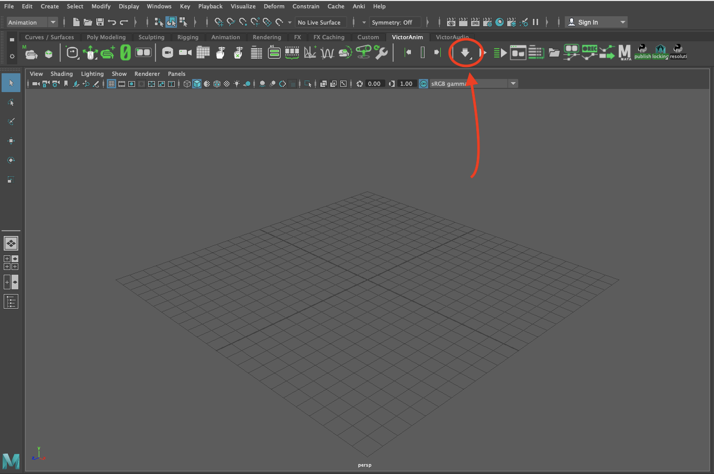
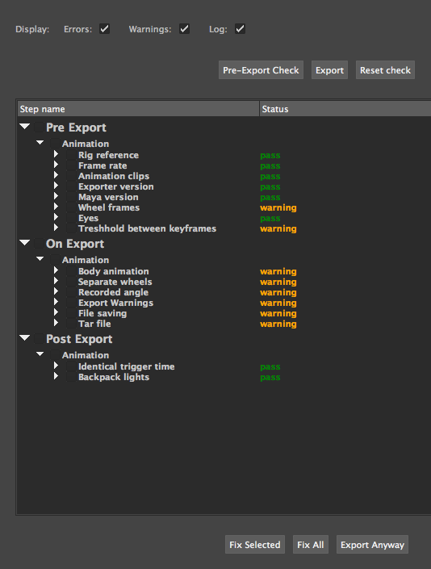
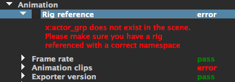
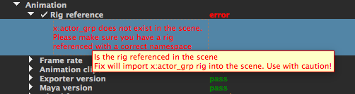

# Error check tool.

Created by Daria Jerjomina

## Opening Error Check Tool
Error check tool opens automatically if you export through a shelf's exporter button  as shown in the image below.

The error check tool will look something like this once opened.

## Error Check Tool Summary
The main part of the tool is the table showing export messages. Messages are color coded depending on whether the check has passed (green), resulted in an error (red) or a warning (orange).

The names of the message headers are displayed in white so that they can be distinguished from the text of the message. In order to see the text of the message you can expand the section with its header.

You can change which messages are displayed in the top panel of the tool

You will see different errors displayed depending on which section is checked. For instance if only Errors is checked the tool will only show the warning messages and not the passed nor error messages.

## Top buttons

### Pre-export check

Pre-export check is being run as part of the exporter, but can also be run separately by pressing the Pre-export check button.

### Export

Acts the same as the shelf export button. Runs export and shows the updated messages.

### Reset Check
Sets messages to their default

## Bottom buttons

### Fix Selected
Runs fixes for all selected parts

### Export Anyway

Exports without updating messages

## Fixing errors

If the error or a warning is something that can be fixed programmatically, you will see the checkbox to the left of the title, which is denoted by an indent next to the message headers.

The checkboxes are a bit hard to see, but if a message header seems indented, then there is a checkbox beside it.

If you are not sure what the fix for the error is going to do, you can hover over the description and you will see the tool tip on how the error is going to be fixed.

Tool tips over the message will also give you a general information about the message.

## Video Demo

## FAQ

__What is the difference between "Export" and "Export Anyway" buttons?__

Export button does the check, displays the messages and then exports the animation. Export anyway button does just the export and no checks. So the second one is much faster, but will not give you information about what can be potentially wrong with your animation.

__My errors are clamped and I can't read them very well. How can I read long messages?__

Just expand the Step name section - that will let you read the messages in case they get clamped

__Do I need to press export button in the tool after I press export button on the shelf?__

No. When you press export button on the shelf it both exports the file and displays any potential problems