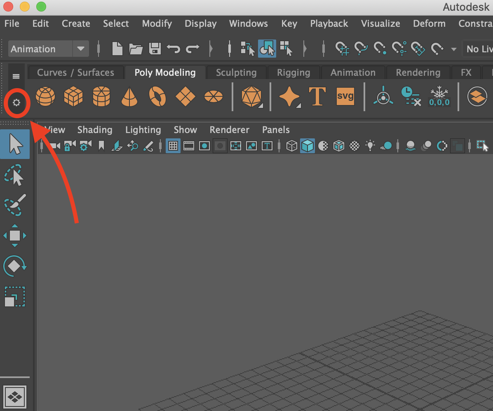

# Maya 2018 Setup for Animation Work

Created by Nishkar Grover, John Nguyen Apr 04, 2019

(see Play Animation on Robot from Maya for some related info after setting up Maya 2018)

## Install Maya 2018:

1. Click the Apple menu/icon and select About This Mac
2. Click the Storage tab and make sure that you have *at least 3 GB* of disk space available on your hard-drive (Macintosh HD)

3. Within Maya 2018, click *Windows → Settings/Preferences → Plug-in Manager* and uncheck “Auto load” for everything except gameFbxExporter.bundle
4. Click *Windows → Workspaces* and then select the option box next to Maya Classic (or whatever workspace you use) and use that UI to set the Menu Set to Animation
5. Click File and then select the option box next to New Scene and use that UI to set the default frame rate to 30 fps
6. Click *Windows → Settings/Preferences → Preferences*, select the Time Slider category and make sure your frame rate is set to 30 fps (also check the Playback settings while in there to ensure those are correct)
7. Use the Shelf Editor to remove the “Animation_User”, “Polygons_User”, “Arnold”, “MASH”, “Motion 8. Graphics” and “XGen” shelves


8. Quit out of Maya 2018
9. Run “open /Applications/Autodesk/maya2018/“ in a terminal and drag “Maya.app” to your Dock for an easy way to launch Maya 2018
10.  Confirm that you can successfully launch Maya 2016 and 2018
11 Quit out of both Maya versions.


### Note:

The first time I launched Maya 2018 from a terminal, I saw:

```
    This application failed to start because it could not find or load the Qt platform plugin "cocoa" in "".
     Reinstalling the application may fix this problem.
     Abort trap: 6
```

and the application failed to launch. I simply tried again and it worked the next time.


## Installing Studio Library:

A new 2.x version of Studio Library was released for 2017+ versions of Maya, so we need separate installations of that for Maya 2016 and Maya 2018.

The Maya Setup page has the following instruction for installing Studio Library for Maya 2016:

```
    Download studiolibrary from http://www.studiolibrary.com/ and move the unzipped folder to ~/Library/Preferences/Autodesk/maya/scripts
```

so if you already have that, you should now:

1. Move that existing installation of Studio Library into the 2016/scripts folder (you can run "mv ~/Library/Preferences/Autodesk/maya/scripts/studiolibrary <br> ~/Library/Preferences/Autodesk/maya/2016/scripts/" to do that)
2. Download the latest 2.x version of Studio LIbrary from http://www.studiolibrary.com/download and put that unzipped studiolibrary folder in ~/Library/Preferences/Autodesk/maya/2018/scripts
3. Launch Maya 2018 and confirm that Studio Library works if you run "import studiolibrary; studiolibrary.main()" in the Python Script Editor
5. Quit out of Maya 2018


## Update Maya 2018 configuration:

1. Update your ~/Library/Preferences/Autodesk/maya/2018/Maya.env file to use Victor repos instead of Cozmo, specifically:

    - update your ANKI_TOOLS setting and change “cozmo-animation” to “victor-animation”
    - update your ANKI_ANIM_DIR setting and change “cozmo-assets” to “victor-animation-assets”
    - update your ANKI_PROJECT_ROOT setting and change “cozmo-one” (or "cozmo-game") to “victor”
    - update your ANKI_ANIM_EXPORT_PATH setting and change “cozmo-assets” to “animation-assets”
    - update your ANKI_SOUNDBANKS setting and change “cozmosoundbanks/GeneratedSoundBanks/Mac” to “victor-audio-assets/victor_robot/dev_mac”

2. Add “MAYA_NO_WARNING_FOR_MISSING_DEFAULT_RENDERER = 1” on its own line to your ~/Library/Preferences/Autodesk/maya/2018/Maya.env file
3. Launch Maya 2018
4. Within Maya 2018, click Windows → Settings/Preferences → Plug-in Manager and check “Loaded” and “Auto 5. load” for AnkiMenu.py and AnkiMayaWWisePlugIn.bundle
6. Within Maya 2018, click File → Set Project... and set the Maya project to be the /Users/<your_name>/workspace/victor-animation directory
7. Within Maya 2018, set the shared Victor pose/anim library (Victor_StudioLibrary) by:
    1. clicking the Settings Menu in upper, right-hand corner of the Studio Library window
    2. selecting Change Root Path 
    3. choosing the /Users/<your_name>/workspace/victor-animation/studioLibrary/Victor_StudioLibrary folder
    4. (if it helps, see Maya Setup for an example of how we do this in Maya 2016)


### Note:

If you double-click a Maya scene file (.ma) in Cornerstone it will likely open that scene in Maya 2018, which is fine when you are working on Victor but not what you want for Cozmo. Therefore, when working on Cozmo animation, you’ll need to launch Maya 2016, click File → Open Scene and then navigate to the Maya scene file that you want to open.
