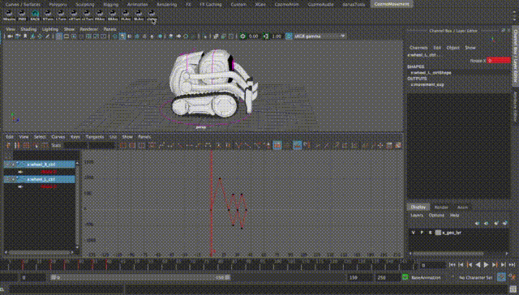

# Movement UI

Created by Daria Jerjomina

A tool for visualizing Cozmo's movement using separate wheels


## Setup

1. Please update your CozmoAnim shelf and the tools folder.
2. Restart Maya
3. Make sure you have a MoveUI button on your shelf

## Main movement buttons


At the top of the ui you will see an image with buttons overlaying it. In order to have Cozmo move a certain amount, press the blue buttons over the arrows . That will overwrite whatever movement cozmo is making at the moment and set a keyframe on the two wheels.  

 
The lighter the arrow is the bigger is the movement going to be. Here is the example of the forward movement arrow:

 Overwrites the values on  both wheels to be 360, 360 comparing to the previous movement 

 Overwrites the values on both wheels to be 180, 180 comparing to the previous movement 

 Overwrites the values on both wheels to be 90, 90 comparing to the previous movement 


In order to add a certain movement to an already existing one, please use the + buttons in order to add value to the wheels or remove the value if the movement is in the opposite direction.

## Add/Multiply switch.

By default you can use + buttons in order to add a set value (5.0) to Cozmo's wheels depending on the movement. - buttons remove that value (5.0) and make Cozmo move the opposite direction.

  

You can change that functionality to increase value by multiplying it, so that it gets exponentially larger or smaller depending on the amount of movement.

  


You can switch between different states (addition or multiplication) by pressing the toggle button in the top right corner. That will update all the buttons in the movement ui to correspond to the current state.

  


## Assign hotkeys to movement shortcuts.
Feel free to add the scripts for the Cozmo UI buttons into the shortcuts if you plan to use them a lot. each one of them is a single line of code which references functions from `wheel_movement.py.`

All buttons appart from the Missing frames one use a single function `ankimaya.wheel_movement.rotate_wheels_by()` which accepts three parameters: value of the left wheel, value of the right wheel, and a bool to show whether it's additive.

So the forward movement by 360 degrees, for example is achieved as:

```
	ankimaya.wheel_movement.rotate_wheels_by(360, 360, False)
```

Turn in place on the other hand will be:

```
	ankimaya.wheel_movement.rotate_wheels_by(360, -360, False)
```


## Additional Buttons

Additional buttons are placed right underneath the image that has Cozmo's movement arrows. Currently there are two additional buttons:


### Add missing Frames


In all instances where one of the wheels is keyed the other one needs to be keyed as well. Otherwise Cozmo's movement in maya might not be displayed correctly. 

### Clamp


Physical robot cannot move over a certain speed (220 mm/s and 300 deg/s) however we don't have a limit for how we set values in Maya.

We catch speeds that go over the limit and clamp them on export, however that only changes the values in the export json file and not in the .ma scene itself.

As a result that may lead to inconsistencies between the exported animation and it's representation in maya.

During export you get a warning that gives information about how much are speeds being clamped and at which frames.


In order to adjust wheel values in maya animators can use a clamp tool, which will trim the values of the wheels that exceed the speed limit and adjust all the following wheel values accordingly.

There is no need to select frames or controllers when using the clamp tool. Clicking the button will automatically find the frames that are over the limit and trim them.




Move following keys

OFF:  ON: 


This is a toggle button. When it's OFF the tool behaves in it's default way, where when pressing one of the movement buttons only the keys at the current frame would change.

When the toggle is ON, all the keys following the current key get moved accordingly.

Custom User Buttons
At the bottom of the window there is a row with custom user shortcuts and a plus button that adds them. When you start the tool for the first time you should see only the plus button. Pressing it will get the values of cozmo wheels comparing to the previous frame and save them as your own shortcut. Now when pressing the new buttons Cozmo will get the wheel values as they were at the frame you recorded them at.

In order to remove a button that you created you can middle click on it.


