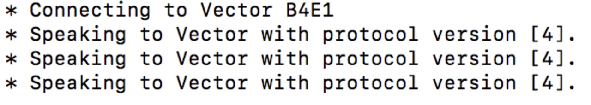
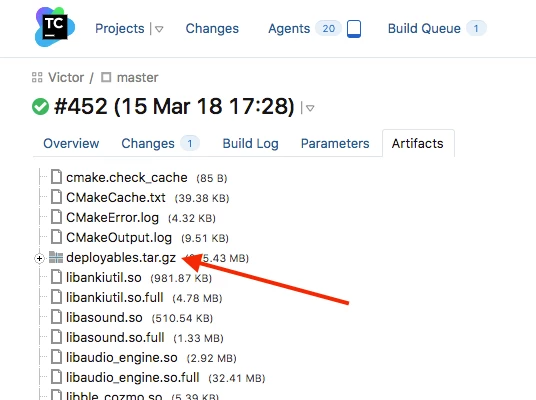
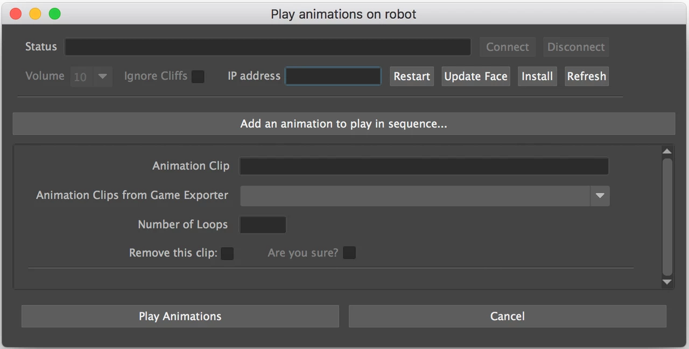

# Play Animation on Robot from Maya

Created by Nishkar Grover 

## Summary

In order to play animations on robot from Maya, you need to have some software installed on the robot (OS and build) and your laptop needs to be able to communicate with the robot over a wifi network.  This page has instructions to help get all of that setup.  There are two options for allowing your laptop to communicate with the robot...  * (1) Laptop and robot are both connected to wifi network  OR  (2) Establish a direct wifi connection between laptop and robot.*  When using the second option, your laptop will not have a standard network connection (for Email, Slack, Jira, Shotgun, etc) unless you have a wired network connection plugged into your laptop.  The first option is probably better when you are working from home since many of us don't have wired network connections that can be easily plugged into the laptop.  The second option is probably better when you are working in the office because of recent wifi network problems and since we should all have a wired network connection at our desk.

## First Time Setup for a New/Different Robot (or After Clearing User Data on Robot)

1. Turn on Bluetooth on your laptop

2.  With the robot powered on and placed on the charger, double-click the backpack button

3.  Take note of the four characters after "Vector" on the robot's screen and use those in place of "XXXX" in the next step (and every other time you use mac-client with this robot)

4.  Run "chmod a+x ~/Downloads/mac-client; killall -9 mac-client; ~/Downloads/mac-client --filter XXXX" in a terminal 

5.  Input the 6-digit pin that you see on the robot's screen when prompted to enter pin

6.  The previous steps worked as expected if you see "vector-XXXX#" in your terminal

7.  See this note if this robot already has a cloud account owner

8.  Run "status" in your terminal and take note of the robot's connection_state

9.  Run "exit" in your terminal

10. Follow the steps on the Logging a Victor into an Anki account page to authorize this robot

## Connect Robot to Network  (required setup for voice commands to work but needs a reliable wifi network)

1.  Turn on Bluetooth on your laptop

2.  Run "chmod a+x ~/Downloads/mac-client; killall -9 mac-client; ~/Downloads/mac-client --filter XXXX" in a terminal 

3.  The previous steps worked as expected if you see "vector-XXXX#" in your terminal

4.  Run "wifi-ap false" in that terminal and look for "Access point enabled with SSID: [] PW: []"

5.  Run "wifi-scan" in your terminal and confirm that you see the expected network in the third column list, eg. "AnkiRobits" when in the Anki office

6.  Run "wifi-connect <network_name> <password>" in your terminal and look for confirmation that "Vector is connected to the internet" (you can use "wifi-connect AnkiRobits KlaatuBaradaNikto!" when in the Anki office)

7.  Run "status" in your terminal and look for confirmation that "connection_state = ONLINE"

8.  Run "wifi-ip" in your terminal and make a note of your robot's IP address, which should be "192.168.xx.xxx" or something similar

9.  Run "exit" in your terminal

## Directly Connect Laptop to Robot  (voice commands will not work but this setup is better if wifi is unreliable)

1.  Turn on Bluetooth on your laptop

2.  Run "chmod a+x ~/Downloads/mac-client; killall -9 mac-client; ~/Downloads/mac-client --filter XXXX" in a terminal   (download the "mac-client" file from https://www.dropbox.com/preview/Victor/Animation/Tools/Robot_Setup/mac-client and then try this step again if you see a "no such file or directory" error)

3.  The previous steps worked as expected if you see "vector-XXXX#" in your terminal

4.  Run "wifi-ap true" in that terminal and look for "Access point enabled with SSID: [Vector XXXX] PW: [xxxxxxxx]"

5.  Run "status" in that terminal and look for confirmation that "access_point = true"

6.  Run "wifi-ip" in your terminal and take note of your robot's IP address, which should be "192.168.xx.xxx" or something similar

7.  Run "exit" in your terminal

8.  Connect your laptop to your robot's wifi network, which is "Vector XXXX", and use the eight-digit numeric password (PW) from step 4

## Check Network Connection

To check if your laptop has a network connection to the robot, try pinging the robot IP address in a terminal.  For example, if your robot's IP address is 192.168.45.116 and you run "ping 192.168.45.116" in a terminal, then you'll see "64 bytes from 192.168.45.116" when you have a connection or "request timeout" if not.

## Troubleshooting

* If mac-client is not giving you any feedback when you try connecting it, check to see if your Bluetooth is turned on your computer.
* If you try connect to the robot or play an animation and it says something about "publickey", then run step 5 from First Time Setup for a New Laptop at the top of this page to see if that fixes the problem.
* If not, see the last section of the Victor DVT3 ssh connection page.


* If you see this above image on your robot's face, then connect to your robot with mac-client and run "anki-auth xxxxxxxx" where "xxxxxxxx" is your token from the ~/.saiconfig file  (you can run "open ~/.saiconfig" in a separate terminal to see that token)
* If you have trouble connecting (one symptom is having it ask for the wifi password over and over), then try putting your robot directly under your laptop and make sure there is no metal between the laptop and robot.


* If you see this above image on your robot's face (which is often the case after installing a fresh OTA/build), then you can right-click in our Maya tool for playing animations on robot and select Set Dev Do Nothing. Alternatively, you could also paste http://192.168.xx.xx:8888/consolefunccall?func=SetDevDoNothing into your web browser to do the same thing.
* If you get an error saying Permission denied (publickey), then run "ssh-add ~/.ssh/id_rsa_victor_shared" in your Terminal and look for confirmation that "Identity added". Refer to  Step 5 if this fix doesn't work.



* If you try to connect to mac-client and it prints Speaking to Vector with protocol version [4]. 3 times, that means your robot was not authorized on the same mac-client that you are using.
    1. Make sure to first Clear User Data on your robot.
    2./ Follow the steps in 'anki-auth SESSION_TOKEN' Troubleshooting section on this page.

## Short Version
This version is provided for more experienced users. Refer to the original and longer version below if this is not detailed enough.

1. Download the latest OTA from either:

    a. the Wiki page and scroll up to the top to find the OTA link

      OR

    b. the Anki TeamCity page from the "Artifacts" tab of the Dev Unstable build

The OTA file should end up in your Downloads folder.

2. Open Terminal and run:

```
   cd ~/Downloads/ && python -m SimpleHTTPServer 8000
```

3. In a new Terminal window or tab, run:

```
   killall -9 mac-client; ~/Downloads/mac-client --filter XXXX
```

      which will run the mac-client.

4. Once connected to mac-client, run:

```
      wifi-ap true
```

  and you'll see in the mac-client will show "Access point enabled with SSID: [Vector XXXX] PW: [xxxxxxxx]"

5. Find your robot's wifi (e.g. Vector XXXX) and connect to it using the password that mac-client provided for you

6. Once you're connected to the robot's wifi, copy down your computer's IP address by holding down the Alt/Option key and clicking on the wifi icon, and then run the command:

```
      ota-start http://<ip_address>:8000/<ota_file_name>     
```

      (Note: the <ota_file_name> is the OTA file you got from Step 1. Example: ota-start http://192.168.1.2:8000/vicos-0.10.1225d.ota)

7. Wait about 20-30 seconds and then run:

```
      ota-progress
```

      to show the progress bar. 

8. After the OTA update completes, the robot will reboot and you should see "Disconnected" in your Terminal.

## Detailed Version

( this requires a direct wifi connection between the laptop and robot, so that is part of the instructions in this section )

1.  Download the "last known good" OS build from this Wiki page and scrolling up to the top (this link might be deprecated: http://ota-cdn.anki.com/vic/dev/werih2382df23ij/full/lkg.ota).

      OR

      Go to the Anki TeamCity page to get redirected to the Dev Unstable build, click on the OS build that you want to install, and then download the  vicos-0.13.<build_number>d.ota  file from the "Artifacts" tab if you need a specific build)

2.  Unplug the ethernet cable from your laptop, monitor or USB port if you have a wired network connection (need to double-check if this is required)

3.  In a Terminal, run:

```
   cd ~/Downloads/ && python -m SimpleHTTPServer 8000
```

     (This will continue running in the background, so feel free to minimize this window)

     Click "Allow" if prompted; this step worked if you see "Serving HTTP on 0.0.0.0 port 8000" in your Terminal   

4.  Turn on Bluetooth on your laptop

5.  In a new Terminal window or tab, run:

```
   chmod a+x ~/Downloads/mac-client; killall -9 mac-client; ~/Downloads/mac-client --filter XXXX
```

6.  The previous steps worked as expected if you see "vector-XXXX#" in your Terminal

      (Note: If you see a "no such file or directory" error, download the "mac-client" file from the Victor Animation Dropbox, and then try this step again)

7.  Run "wifi-ap true" in that terminal and look for "Access point enabled with SSID: [Vector XXXX] PW: [xxxxxxxx]"

8.  Run "status" in that terminal and look for confirmation that "access_point = true"

9.  Connect your laptop to your robot's wifi network, which is "Vector XXXX", and use the eight-digit numeric password (PW) from step 7  (you should uncheck the "Remember this network" option when providing the network password)

10. Hold down the [option] key (or [alt] key) on your keyboard and left-click the wifi icon in the desktop status menu to look for the current IP address, which is difficult to see because it is grayed out and will probably be 192.168.0.2 or 192.168.1.2 or something similar as shown in the image below


(Note: You can also find this by left-clicking on the wifi symbol and selecting "Open Network Preferences...")

11. Using the IP address from the previous step and the exact name of the file that you downloaded in Step 1, run:

```
   ota-start http://<ip_address>:8000/<ota_file_name>
```

       (For example, "ota-start http://192.168.0.2:8000/lkg.ota" or "ota-start http://192.168.1.2:8000/vicos-0.10.1225d.ota") in your Terminal

12. Wait about 30 seconds and then run "ota-progress" in your terminal to see progress during the OTA update and confirm that it eventually gets to 100%  (if you see "[-2147483648%] [0/0]" then try running "ota-progress" again)

13. If you see the flashing exclamation point in a cloud on the robot's face, then turn the robot off/on using the backpack button and repeat these steps starting at step 5

14. The robot will reboot and you should see "Disconnected" in your terminal after the OTA update completes.

15. Feel free to reconnect your ethernet cable and/or reconnect your laptop to a wifi network.

##Install Master Build on Robot

( __this requires your laptop to be able to communicate with the robot for the final two steps, so that connection should be established in step 3__ )

1.  Go to https://build.ankicore.com/viewType.html?buildTypeId=Victor_Master&tab=buildTypeHistoryList and click on the master build that you want to install on your robot (use the newest successful/green build by default)

2.  Go to the "Artifacts" tab and download the deployables_xxxxxxxxxx.tar.gz file into your personal Downloads folder



3.  Make sure that your laptop and robot are both connected to the network OR establish a direct connection between your laptop and robot  (see instructions above)

4.  Open the preview/playback UI in Maya



5.  Input your robot's IP address, eg. 192.168.43.29 or 192.168.0.1 or 192.168.1.1

6.  Click Install button, which may take a few minutes to complete

7.  Play an animation and confirm that it works as expected

## 'anki-auth SESSION_TOKEN' Troubleshooting

If anytime you encounter a message that says something like:

```
    Vector has an Anki account owner, and you need to prove that's you!
    Use the command 'anki-auth SESSION_TOKEN' to do so.
```	

This can happen if:

You haven't authorize your Vector with either the sai-go-cli or tokprovision
You've already authorized your Vector, but he's connected to a new wifi that he hasn't been authorized on yet.

To fix this:

1. Open up a Terminal and type in: open ~/.saiconfig

     This is assuming you've gone through with the 'sai-go-cli' client.

2. This should open up a text editor. If nothing happened or you get an error that say: .saiconfig does not exist. then you most likely didn't went through the sai-go-cli step.

!()[image2018-8-31_9-40-2.png]


Note: If your computer cannot find this .saiconfig file, then you will need to create the .saiconfig file using your current credentials with the command:

    ~/Downloads/sai-go-cli accounts login -u yourEmail@anki.com -p your_password

If you do not have an account, create one with the following command:

    ~/Downloads/sai-go-cli accounts create-user -e yourEmail@anki.com -p your_password --dob YYYY-MM-DD


4. Connect your Vector with mac-client.(3) Copy your unique token value, which is the last row.

5. Once your Vector is connected to mac-client, make sure he's connected to wifi.

      a. If you forget how to connect Vector to wifi, run:

         wifi-scan

          in the mac-client window, and then run:

    wifi-connect <your wifi> <your wifi password>

        (don't type in the angle brackets).

6. Once he is connected, run the command: 

         anki-auth <Your token value from step 2>

7. This shouldn't take more than 20 seconds and return true if the authorization was successful.

8. At this point, you should be able to work with Vector like you normally would.

## Boot Robot from Recovery Partition (aka "Factory Settings")

With the robot powered on and placed on the charger, press and hold the backpack button for approximately 12 seconds until the backpack lights turn off and then turn back on again.

If you then see "Vector XXXX" and "anki.com/v" on the robot's screen, the robot has successfully booted into recovery mode.

To exit recovery mode, lift the robot off the charger and hold the backpack button until the backpack lights (and robot) turn off and then simply power the robot back on.


## Next Steps

1. Cleanup the tools/robot_scripts/ and tools/pylibs/ankisdk/ directories in the victor-animation SVN repo.