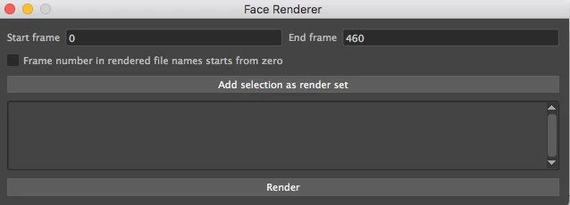

# Render png sequences using face renderer tool.

Created by Daria Jerjomina Apr 04, 2019

**How to easily export png sequences with or without specified selected objects.**

You can bring up face renderer tool by clicking a corresponding button on the shelf.

The UI of a face renderer tool looks like:

When you first open the tool the start and the end frame get set to be the *start* and the *end* frame of the clip.

You can now simply press render and it will render your eyes animation from the png camera and save them inside your images directory.

The directory with the images will open at the end of the rendering.

By default the name of the directory will be the name of the clip, if the timeframe you chose intersects any animation clips,  otherwise it will have the name of the maya scene, and if the scene you work in is unnamed and has never been saved, the directory will have a default name "face_render"

If you chose to give your files a custom name press "Add selection as render set". If nothing is selected, it will render everything in the scene (same as if you haven't added a selection set).

You can now rename the set with any name you want, and render it.

You can also select custom objects, so that to render only them. Hovering over your selection sets will show you which objects you have added.

Now if you press render png images will be rendered with the specific names you have assigned to them and the images will only have the objects you have selected.

The button on the right of the selection set names allows you to remove it.

### Frame number in rendered sequence starts from zero

If this option is off the number sequence in the name of the image will start from the start frame number. If it's on the frame numbering in the name of the file starts from zero instead of the number of the start frame.

### Some extra info

The selection sets that have objects assigned to them get corresponding render layers created. So you can now modify them within maya's rendering setup tool (Windows→Rendering Editors→Render Setup)

Your selected objects get added under collections of the layers with the name that you created in the face_renderer tool.

(The extra untitled collection gets created in the layer by default, you can either ignore it or read on it more in https://knowledge.autodesk.com/support/maya/learn-explore/caas/CloudHelp/cloudhelp/2018/ENU/Maya-Rendering/files/GUID-A622E999-38E6-46B1-939F-F8FA6D3D61BA-htm.html)

Selection sets without any objects assigned  to them will not have corresponding render layers created. However upon closing the tool the empty layers will result in a creation of an empty node "render_data_storage" which will be specific to the scene and will stay with it if you save it. That node has an empty_selection_sets attribute with information on the empty selection sets names. That is done so that selection sets can be repopulated on opening the tool again. That means that if you remove that node from the scene, information about the empty selection sets will be removed (the node gets removed automatically, if you remove all the empty selection sets in the tool upon closing it)

As for the non-empty selection sets they get populated back from the layers that got created. The objects will correspond to the ones under the render layer's collections. 