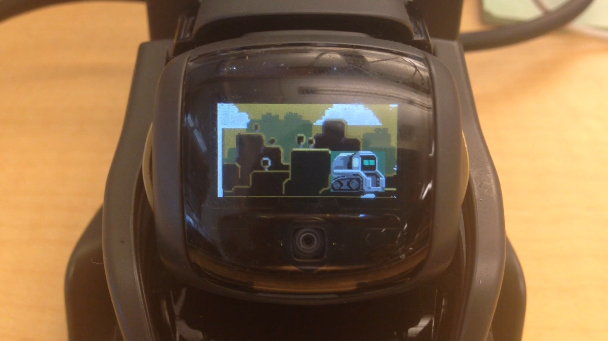
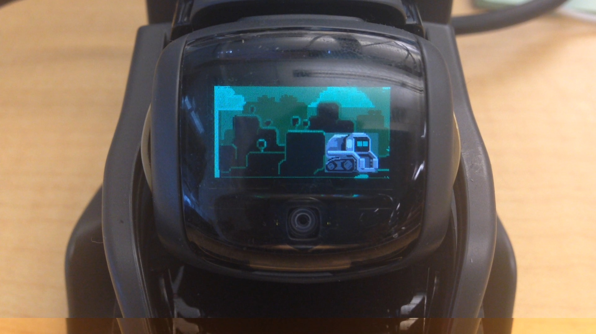
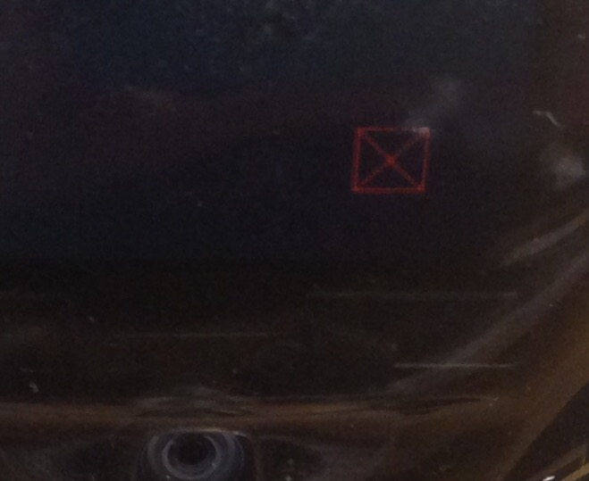

# Sprite animation using Sprite Box Creator.
Created by Daria Jerjomina Apr 15, 2019

A tool for creating and setting keyframes on a Sprite Box.

Sprite box is a new feature, which allows to display png images or sequences of images on vector's screen, and animate their parameters.

## Creating a sprite box.

To create a sprite box bring up the Sprite Box Creator tool.

## Choosing an asset for a sprite box.

Chose the sprite or a sequence of sprites that you want to be displayed from an asset name drop down menu

Clear sprite box is a default and means an absence of an asset - you can use it to remove an existing sprite box.

Asset names are being populated from victor-animation-assets/sprites. So make sure you update your victor-aniamtion-assets, and that the sequence or a png image you want to use is in that directory.

You can add new sequence asset through a png package tool.

You can add a new static image by placing a png file under sprites/independentSprite.

If you chose an asset that consists of multiple images you will see Frame number change. That will give you an idea of how many frames there are in the chosen asset.

In the example above the asset consists of 21 images, so it would last for 21 frames.

You can search for the asset you need via a search bar on the side of the asset line:

## Setting a sprite box layer.

Layer specifies where your sprite box is going to be positioned on the Z axis.

you can chose layers between 1 and 10.

The eyes are positioned in between layers 5 and 6, so all layers before and including layer 5 are going to be displayed behind the eyes and layers above and including layer 6 are going to be positioned in front of the eyes.

NOTE: Currently layers 4 and 5 are not working correctly. Even though they are supposed to go behind the eyes they are placed in front of them. Please avoid using them until the fix is in. If you need to position layers behind the eyes you can use layers 3 and below.

By default layer is set to 10 which is closest to the camera (and thus furthest from the eyes in front of them).

Note: You can create multiple sprite boxes and position them in front of one another by setting different layers. That way you can combine foreground and background elements.

## Choosing a render method.

You can chose a render method from two options specified by radio buttons.

*RGBA* is a default setting and means that the sprite is going to have a color as it is displayed in the png sequence (first image below)

*Eye Color( displays the image in the the color of Vector's eyes (which can be chosen by a user) (second image below)

## Choosing loop configuration.

Loop configuration determines what should happen when sprite sequence finishes playing.

This setting will only take an effect in case of a sequence of sprites. This setting doesn't matter in case of a single sprite image. 

You can chose loop configuration from three options: Clear, Loop and Hold.

Clear will stop the animation of the sequence once it goes through all of it's images.

Loop will run the same sequence again after the original one stops playing.

Hold displays the last image in the sequence after it stops playing and until the end of the clip

## Setting position of the sprite box.

Sprite box's position can be set in the tools's UI by inserting values for x and y coordinates.

The values are set in px in relation to the top left corner of the screen.

So the top left corner coordinates are x:0, y:0 and bottom right corner's position's px coordinates are 184, 96.

The sprite box's pivot point is at the top left corner, so 184, 96 will position the sprite box outside of the screen making it invisible

Note: You can also keep these values at 0 and change the position of the sprite box manually after it's created.

## Setting width and height of the sprite box.

Width and height is populated automatically when you chose an asset, so there is almost never a need for you to change it.

If you do need to modify it note that it is set in pixels same as the position attributes.

## Setting alpha.

Alpha is a value from 0 to 100 that represents the transparency of the sprite box. 0 represents the fully transparent image and 100 an opaque one.

Creating a sprite box.

Pressing Create Sprite Box button will create a plane in front (or behind depending on the layer) of vector's eyes. That plane represents the sprite box in the scene.

The attributes you have inserted in the UI of the tool will be displayed in the channel box. Some of them get converted to maya units.

Position parameters for instance are displayed as translation x and y

Layer is converted to translation z

Width and height are converted to scale x and scale y

And alpha becomes transparency with values between 0 and 1, where 0 is opaque, and 1 - transparent.

## Setting keyframes

Once the sprite box is created you will see that the button for creating sprite boxes has changed to "Set Sprite Box Keyframe"

That is also the case if you select an existing sprite box.

In case of a sprite box selection tool changes to a keyframe setting mode.

So now any parameters you change in the UI will reflect on the sprite box after you press set keyframe.

Setting a keyframe through attributes

Of course, you don't have to use the tool to set a keyframe, you can also do it in maya, as you would set any attribute via the channel box or the graph editor.

Setting keyframes in maya usually works better for translation, render method, and loop config attributes. Asset name and layer are easier to set through the tool.

## Troubleshooting.

Sprite displays on the robot's face as a red square:

This means that the image is missing. Make sure you have a new created image under the sprites directory and run "Send local assets to the robot" from MacBlast:

