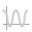
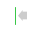
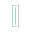
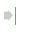

# VictorAnim Shelf in Maya

Created by Juan Sierra May 14, 2018

 - Reference Victor: This button will bring a Reference of the Victor rig into your Maya scene.

 - Reference New Blocks: This button will bring a Reference of 3 Box rigs into your Maya scene.

 - Victor Picker: This button will open the Victor Picker. In this window you will be able to automatically select the different controls and control groups on the Victor rig as well as have automated actions.

 - Robot Movement: This button will open the Robot Movement window. With this tool you will be able to move the rig in space as the wheels automatically update according to the set movements and rotations.

 - Select All Victor: This button will select all of the Victor's rig controls except for the Settings Node 

 - FaceCam: This button will open the Face Camera window. This window shows a constant front view of Victor's face.

 - Reference Video: This Button will open the Reference Video window. Look for the Camera named "redCam_01" in the Outliner. In here you can bring MOV files to use as reference for your animations. 

 - Open Studio Library: This button will open the Studio Library window. In here you will find pre existing poses, expressions and animations for Victor.

 - Mute Animation Channels: This button will mute all of the animation channels of a control or an object. You need to select the object first and then press this button for the Mute to happen.

 - Unmute Animation Channels: This button will unmute all of the animation channels of a control or an object. You need to select the object first and then press this button for the Unmute to happen.

 - Open the Game Exporter: This button will open the Game Exporter. In here you will be able to name and create animation clips

 - Animation Group Editor: This button will give you access to the animationGroups located under /workspace/victor-animation-assets/animationGroups. In here you can create, and edit animation groups that will be populated with animation clips for the rest of the team to use.

 - Make PNG Package: This button will open the Make PNG Package window. In here you can create tar files from your png sequences. This tar files are the ones used by the team to put animations on Victor's screen

 - Add Graph Editor: This button will open a new Graph Editor for you to use. *It needs the Aaron Koressel script (ack) to work.

 - Wave Tool: This button will open the Wave Curve Tool. In here you can create a Wave shape for any curve on the Graph Editor; you can control the wave height and length . Remember to select the curve on the Graph Editor before pushing "Create Curve".

 - Export Head Angle:  This button will open the Head Angle Variations window. This window allows you to create multiple animation clips from the same animation. But every new animation clip will have a different head angle.

 -  Convert Moac Animation to Separate Wheels: When opening old Cozmo files, this button will allow you to convert the Moac Animation to Separate Wheels animation in the clip. We do this because Moac Animation is not used anymore.

 - Reload Tools:  This button will update all of the tools and reload scripts. 

 - Copy Values from Previous Frame select key in Graph. Remember to select the Key you want to be affected in the Graph Editor.

 - Snap Selected Keys Halfway between the Previous and the Next Key. Remember to select the Key you want to be affected in the Graph Editor.

 - Snap Values to the Next Frame. Remember to select the Key you want to be affected in the Graph Editor.

 - Export All the Animations to JSON: This button exports your animation soy you can view it on Victor.

 - Preview on Robot: This button was used to preview Cozmo's animation. It is not used anymore, For previewing Victor's animation use the button below.

 -Preview Selection Tool: This button will open the Play Animations on Robot window, this tool will allow you to play your animations live on a real Victor model. You can set the IP address of your Victor and add other animations in sequence to preview live on it.  

 - Preview Face: This button will open the Face Preview window. In here you can see a more accurate representation of the animation on Victor's Screen.

 - Copy Animation Clip : This Button will open the Copy Animation Clip window. In here you can copy Animations clips, you can also save them as new files.
